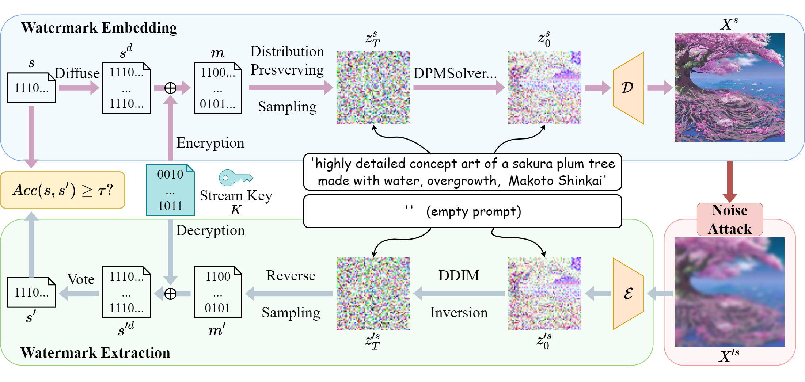

# Gaussian Shading: Provable Performance-Lossless Image Watermarking for Diffusion Models

[](https://arxiv.org/abs/2404.04956)

This repository hosts the official PyTorch implementation of the paper: ["**Gaussian Shading: Provable Performance-Lossless Image Watermarking for Diffusion Models**"](https://arxiv.org/abs/2404.04956) (Accepted by CVPR 2024).


## Method



We propose a watermarking method named Gaussian Shading, designed to ensure no
deterioration in model performance. The embedding process encompasses three primary elements: watermark diffuse, randomization, and distribution-preserving sampling. Watermark diffusion spreads the watermark information throughout the latent representation to enhance the robustness. Watermark randomization and distribution preserving sampling guarantee the congruity of the latent representation distribution with that of watermark-free latent representations, thereby achieving performance-lossless. In the extraction phase, the latent representations are acquired through Denoising Diffusion Implicit Model (DDIM) inversion, allowing for the retrieval of watermark information. 


## Getting Started

### Setting up evironment

#### Step 1: Cloning the repo
```
git clone https://github.com/AlessandroPerez/Gaussian-Shading.git
cd Gaussian-Shading
```

#### Step 2: Create Conda environment
```
conda create -n gs python=3.10 -y
conda activate gs
```

#### Step 3: Downloading Packages via Conda
```
# Install PyTorch 2.6+ with CUDA support (required for security compliance)
# This ensures compatibility with the latest transformers library
conda install "pytorch>=2.6" torchvision torchaudio pytorch-cuda=11.8 -c pytorch -c nvidia -y

# Alternative: Install the latest PyTorch (recommended)
# conda install pytorch torchvision torchaudio pytorch-cuda=11.8 -c pytorch -c nvidia -y
```

#### Step 4: Install remaining Python packages via pip
```
pip install -r requirements.txt
```

#### Step 5: Verify installation (optional)
```
python test_dependencies.py
```

**Note**: PyTorch is installed via conda in Step 3 for better CUDA compatibility. The requirements.txt contains all other dependencies. If you encounter segmentation faults, use the memory optimization flag when running tests.

### Test True Positive Rate and Bit Accuracy

For testing in a lossless situation, you can run,
```
python run_gaussian_shading.py \
      --fpr 0.000001 \
      --channel_copy 1 \
      --hw_copy 8 \
      --chacha \
      --num 1000
```


To test the performance of Gaussian Shading under noise perturbation (e.g., JPEG QF=25), you can run, 
```
python run_gaussian_shading.py \
      --jpeg_ratio 25 \
      --fpr 0.000001 \
      --channel_copy 1 \
      --hw_copy 8 \
      --chacha \
      --num 1000
```
For more adversarial cases, You can refer to [this script](scripts/run.sh).

### Calculate CLIP Score

To calculate the CLIP Score, it relies on two pre-trained models, you can run,
```
python run_gaussian_shading.py \
      --fpr 0.000001 \
      --channel_copy 1 \
      --hw_copy 8 \
      --chacha \
      --num 1000 \
      --reference_model ViT-g-14 \
      --reference_model_pretrain laion2b_s12b_b42k 
```

### Calculate FID

When calculating  FID, we have aligned our settings with [Tree-Ring Watermark](https://github.com/YuxinWenRick/tree-ring-watermark) and used the same ground truth dataset. The dataset contains 5000 images from the COCO dataset. You can find the corresponding information such as prompts in 'fid_outputs/coco/meta_data.json'. 
The ground truth dataset can download [here](https://drive.google.com/drive/folders/1saWx-B3vJxzspJ-LaXSEn5Qjm8NIs3r0?usp=sharing).


Then, to calculate FID, you can run,
```
python gaussian_shading_fid.py \
      --channel_copy 1 \
      --hw_copy 8 \
      --chacha \
      --num 5000 
```


## Comprehensive Watermark Testing

### Environment Setup (Required First)

**Using Conda (Recommended)**
```bash
# Step 1: Create and activate conda environment
conda create -n gs python=3.10 -y
conda activate gs

# Step 2: Install PyTorch with CUDA support (version 2.6+ required)
conda install "pytorch>=2.6" torchvision torchaudio pytorch-cuda=11.8 -c pytorch -c nvidia -y

# Step 3: Install remaining dependencies
pip install -r requirements.txt
```

**Note**: For best GPU performance and stability, use the memory optimization setting when running tests.

### Available Test Scripts

#### Quick Diagnostic Test
For rapid watermark verification (perfect detection on clean images):
```bash
conda activate gs
python diagnostic_test.py
```

#### Simple Test System (Recommended)
For comprehensive watermark testing with attack robustness:
```bash
conda activate gs
PYTORCH_CUDA_ALLOC_CONF=max_split_size_mb:512 python simplified_gaussian_test.py --num_images 100 --output_path "./test_results/"
```

#### Large Scale Testing (1000 images)
For extensive evaluation:
```bash
conda activate gs
PYTORCH_CUDA_ALLOC_CONF=max_split_size_mb:512 python simplified_gaussian_test.py --num_images 1000 --output_path "./final_results/"
```

#### CPU-Only Testing (if GPU issues)
```bash
conda activate gs
python simplified_gaussian_test.py --num_images 50 --cpu_only --output_path "./cpu_results/"
```

### Test Configuration Options

**Key Parameters for `simplified_gaussian_test.py`:**
- `--num_images`: Number of images to test (default: 10)
- `--output_path`: Output directory for results and images (default: "./simple_test_output/")
- `--cpu_only`: Force CPU usage (useful for troubleshooting)

**Watermark Parameters:**
- `--fpr`: False positive rate (default: 0.000001)
- `--channel_copy`: Channel copy parameter (default: 1)
- `--hw_copy`: HW copy parameter (default: 8)

**Example with custom parameters:**
```bash
conda activate gs
PYTORCH_CUDA_ALLOC_CONF=max_split_size_mb:512 python simplified_gaussian_test.py \
    --num_images 500 \
    --output_path "./my_test_results/" \
    --fpr 0.000001 \
    --channel_copy 1 \
    --hw_copy 8
```

### Attack Types Available

The test system includes robustness testing against:
- **Compression**: JPEG at various quality levels (95, 75, 50, 25)
- **Noise**: Gaussian noise (mild, moderate, strong)
- **Blur**: Gaussian blur (mild, moderate, strong)  
- **Resize**: Image resizing (90%, 80%, 70%)
- **Crop**: Center cropping (90%, 80%, 70%)
- **Brightness**: Brightness adjustment (120%, 80%)

### Test Output and Results

**Directory Structure:**
Tests save results to the specified output directory (default: `./simple_test_output/`):
```
output_directory/
├── watermarked_images/          # Generated watermarked images (.png)
├── clean_images/                # Generated clean reference images (.png)  
├── attacked_images/             # Images after applying attacks
└── results/
    ├── test_results.json        # Detailed JSON results with all metrics
    └── report.txt              # Human-readable summary report
```

**Results Include:**
- **F1 Score**: Harmonic mean of precision and recall (key metric)
- **Precision**: TP / (TP + FP) - accuracy of watermark detection
- **Recall**: TP / (TP + FN) - how many watermarked images were detected
- **Confusion Matrix**: True/False Positives and Negatives for each attack
- **Timing Statistics**: Average processing time per image
- **Attack Analysis**: Performance breakdown by attack type and intensity

### Expected Performance

**Perfect conditions (no attacks):** F1 Score = 1.000
**With attacks:** Performance varies by attack type and intensity
- JPEG compression: Robust across quality levels
- Mild blur/noise: Generally robust
- Strong attacks: May significantly impact detection (expected)

**Sample output:**
```
🏆 TEST SUMMARY
   ⏱️  Duration: 25.3 minutes
   📊 Total Images: 100 (50 watermarked, 50 clean)
   🎯 Average F1: 1.000
   ✅ All attacks: Perfect detection (F1: 1.000)
```

### Prompt System

The test system uses a comprehensive set of 1000 predetermined prompts from `prompts_1000.json`, organized into 10 categories:
- Nature & Landscapes
- Animals & Wildlife  
- People & Portraits
- Urban & Architecture
- Interiors & Objects
- Fantasy & Sci-Fi
- Abstract & Artistic
- Food & Culinary
- Seasons & Weather
- Historical & Cultural

This ensures consistent and diverse testing across different content types.

### Troubleshooting

**PyTorch Version Issues:**
If you get an error about `torch.load` requiring PyTorch 2.6+:
```bash
# Update PyTorch to the latest version
conda activate gs
conda update pytorch torchvision pytorch-cuda -c pytorch -c nvidia

# Or install specific version 2.6+
conda install "pytorch>=2.6" torchvision pytorch-cuda=11.8 -c pytorch -c nvidia
```

**GPU Issues:**
- Use `PYTORCH_CUDA_ALLOC_CONF=max_split_size_mb:512` for memory optimization
- Try `--cpu_only` flag if GPU crashes persist
- Ensure you're in the `gs` conda environment

**Common Commands:**
```bash
# Check environment
conda activate gs
python -c "import torch; print(f'CUDA available: {torch.cuda.is_available()}')"

# Test with small batch first
conda activate gs
PYTORCH_CUDA_ALLOC_CONF=max_split_size_mb:512 python simplified_gaussian_test.py --num_images 5

# Full test run
conda activate gs  
PYTORCH_CUDA_ALLOC_CONF=max_split_size_mb:512 python simplified_gaussian_test.py --num_images 1000
```

### Additional Notes
- The code is compatible with Stable Diffusion versions 1.4, 2.0, and 2.1, where the latent space size is 4 x 64 x 64. If you want to apply it to other versions of the diffusion model, you will need to adjust the watermark parameters accordingly.

- By default, Gaussian Shading has a capacity of 256 bits. If you want to change the capacity of the watermark, you can adjust `--channel_copy` and `--hw_copy`.

- Test results are saved in JSON format for further analysis and include both individual image results and aggregated statistics.

- The test system automatically handles CPU/GPU compatibility and falls back gracefully when CUDA is unavailable. 

- Due to the time-consuming nature of Chacha20 encryption, we offer a simple encryption method. It involves using Torch  to generate random bits, which are then XORed with the watermark information directly. By removing  `--chacha ` before running, , you can speed up the testing process. While this method may not be strictly performance-lossless, it is still an improvement over the baseline method mentioned in the paper.


## Acknowledgements
We heavily borrow the code from [Tree-Ring Watermark](https://github.com/YuxinWenRick/tree-ring-watermark). We appreciate the authors for sharing their code. 

## Citation
If you find our work useful for your research, please consider citing the following papers :)

```

@article{yang2024gaussian,
      title={Gaussian Shading: Provable Performance-Lossless Image Watermarking for Diffusion Models}, 
      author={Yang, Zijin and Zeng, Kai and Chen, Kejiang and Fang, Han and Zhang, Weiming and Yu, Nenghai},
      journal={arXiv preprint arXiv:2404.04956},
      year={2024},
}

```